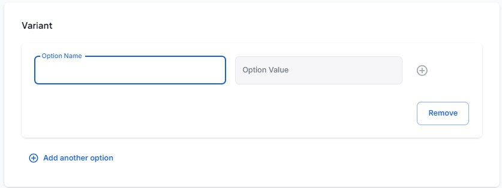
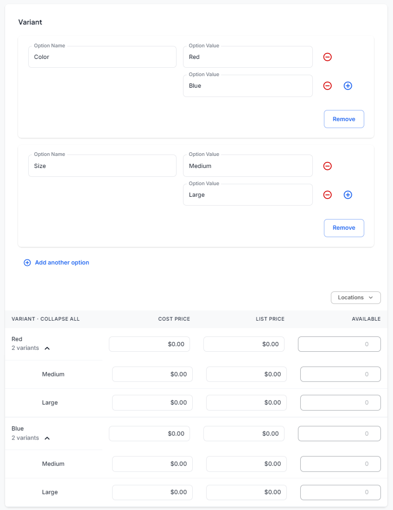

# Product Variant System: How It Works

This guide explains how to use our product variant system when adding new products to the website.

## Add Product Form

When adding a new product, you'll encounter the following fields:

1.  **Title**: Enter the product name.
2.  **Pricing**:
    - Cost per item - Enter the production or wholesale cost of a single unit of the product
    - Price - Specify the selling price for a single unit
3.  **Product Type** (choose one):
    - Finished good - A physical product you track inventory for.
    - Service
    - Subscription
4.  **Track Quantity** (for Finished Goods only):
    - Select from a list of mapped locations
    - Add quantity for each selected location
5.  **Variants**:
    - This is a crucial field where you can customize your product options.
    - Variants allow you to create different versions of a product (e.g., different sizes, colors, materials, etc.). You can add **up to 3 parent variants**.
    
    

### Creating Variants

1.  Enter an Option Name (e.g., "Size", "Color", "Material")
2.  Add multiple Option Values for each Option Name (e.g., "Small", "Medium", "Large" for "Size")
3.  Repeat this process for up to 3 parent variants

## Variant Table

After creating variants, a table will appear showing all possible combinations of your variants. This table includes:

- All variant combinations
- Cost Price (initially populated from the "Cost per item" field)
- List Price (initially populated from the "Price" field)
- Available Quantity

### Managing Available Quantity

1.  Select a location from the dropdown in the top-right corner of the table
2.  Edit the "Available" column for each variant
3.  If "All Locations" is selected, the Available Quantity will be set to 0 and disabled
4.  You must select a specific location to edit Available Quantity
